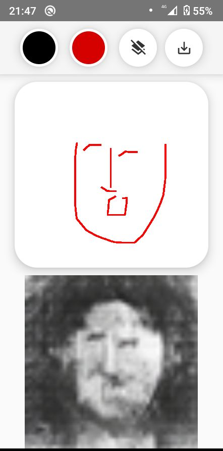
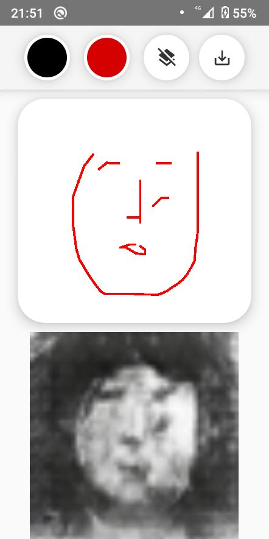
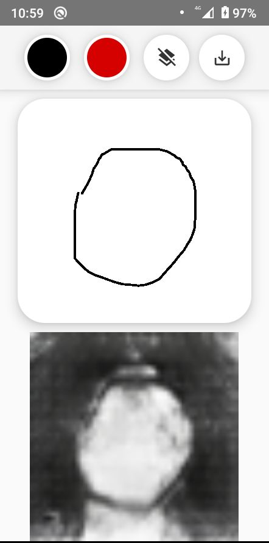
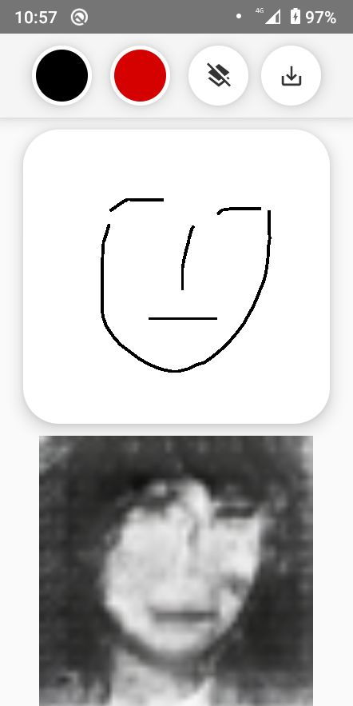

# Art Generator
This is a Kotlin app that uses a machine learning model hosted on a server to translate rough sketches into realistic portraits. The app allows users to create a sketch by drawing on the screen, and then sends a screenshot of the drawing to the server for processing. The server converts the sketch into a portrait and sends it back to the app, which displays the portrait to the user.

## Requirements
  - Android device with a touchscreen and internet connectivity

## Technical Details
The app uses [Image-to-image translation with conditional adversarial networks](https://arxiv.org/abs/1611.07004) hosted on a server to translate the sketch into a portrait. The model was trained on a large [dataset](https://www.kaggle.com/datasets/kairess/edges2portrait) of sketches and portraits, and is able to generate realistic portraits from rough sketches.

The app communicates with the server using HTTP requests and JSON payloads. It sends a screenshot of the sketch to the server, and the server returns the resulting portrait in the form of a base64 String.

The app was developed in Kotlin and makes use of various Android libraries and frameworks, such as the Android SDK, Retrofit.

## Demo

